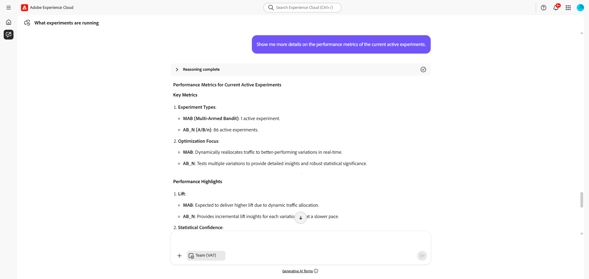

# 實驗代理程式

>[!AVAILABILITY]
>
>Experimentation Agent可供所有可存取AI Assistant的客戶使用。 但是，您需要以下許可權才能完全使用Experimentation Agent功能。
>
>**檢視實驗**：此許可權可讓您使用實驗代理程式，直接在AI Assistant中檢視實驗見解。
>
>**管理實驗中繼資料**：此許可權可讓您使用實驗代理程式，直接在AI Assistant中建立新的實驗。

## 概觀

**Experimentation Agent**&#x200B;是AI支援的工具，可更新您跨網站、電子郵件、推播訊息和應用程式執行和管理數位實驗的方式。 **Experimentation Agent**&#x200B;以Adobe Experience Platform AI平台和實驗工具為基礎，可協助您更有效率地執行實驗、組織業務目標，以及產生可操作的深入分析，並著重說明哪些有效專案、哪些無效專案，以及下一步在何處實驗。

做為Experimentation Accelerator功能的一部分，代理程式提供：

* **效能**：實驗中所發生情況的清楚檢視

* **深入分析**：結果發生原因的說明

* **機會**：後續要採取的動作指南

實驗代理程式範例

## 使用案例

Experimentation Agent藉由分析結果、解譯內容並建議後續步驟來增強實驗工作流程的每個階段。

其功能可分組為五個主要功能：

* **實驗摘要**

  為利害關係人提供清晰、非技術性的實驗結果概觀。

* **內容分析**

  檢查處理的傳訊或創意元素，瞭解為什麼某些處理勝過其他處理。

* **屬性識別**

  依處理的主要屬性（例如，主題、色調、格式）將處理分類，並將這些屬性與轉換結果連結。

* **建議產生**

  根據先前實驗的深入分析，建議新的處理或測試調整。

* **個機會**

  識別更廣的領域或新角度，以便實驗發掘未開發的潛力。

## 範圍內和範圍外功能

### **範圍內**

目前支援下列功能：

* 效能
* Insights
* 機會

### **範圍外**

目前不支援以下功能：

* 建立或編輯實驗
* 使用多個量度來報告使用案例

## 範例提示

以下提供提示範例清單，可協助您開始使用Experimentation Agent：

### 一般問題

| 提示 |
|-|
| 正在執行哪些實驗？ |
| `<campaign name>`正在執行哪些實驗？ |
| 上個月開始了哪些實驗？ |
| 過去一年中有多少實驗結束？ |
| 目前暫停/停止/等哪些實驗？ |
| 最近的測試有哪些常見模式？ |
| 上個季度實驗的平均期間是多少？ |

### 效能問題

| 提示 |
|-|
| 針對我的`<experiment name>`，採用什麼處理方式？ |
| `<experiment name>`的提升度為何？ |
| 哪些實驗具有統計顯著的結果？ |
| 哪些實驗的轉換率最高？ |

### 見解問題

| 提示 |
|-|
| 什麼是`<experiment name>`測試？ |
| 我們從`<experiment name>`中學到了什麼？ |
| 您能告訴我為何要治療A贏嗎？ |
| 勝出變體中的趨勢是什麼？ |
| 最近的測試有哪些常見模式？ |
| `<experiment name>`中發生任何未預期的情況嗎？ |

### 機會問題

| 提示 |
|-|
| 您建議我在完成此實驗後做什麼？ |
| 可以改善`<experiment name>`嗎？ |
| 在`<experiment name>`之後，哪些機會變得更清晰？ |
| 接下來我可以測試哪些專案來證明`<experiment name>`的假設？ |
| 我應該實施哪些其他使用案例？ |
