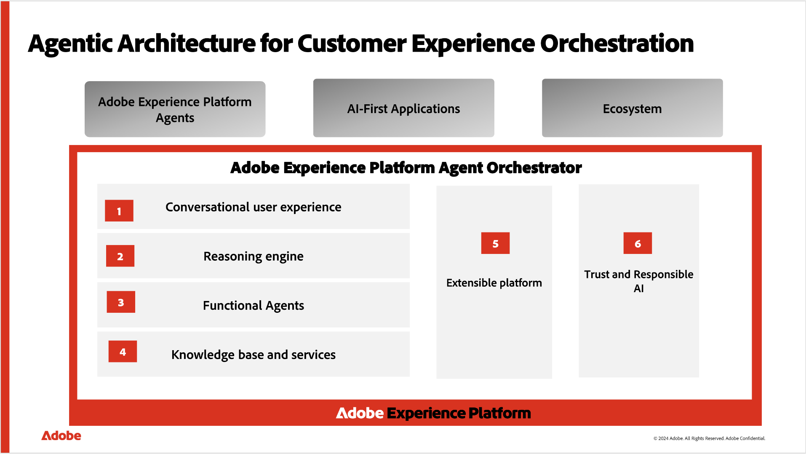

# Adobe Experience Platform Agent Orchestrator

Adobe Experience Platform Agent Orchestrator 是 Adobe Experience Platform 全新的代理層。Experience Platform Agent Orchestrator的設計宗旨是善用Experience Platform豐富的資料和客戶知識，其智慧和推理功能源自專門建置的Adobe Experience Platform代理程式，可讓他們快速且大規模地執行複雜的決策和問題解決任務，而且完全仰賴人力監管。 當您透過像 AI 助理這樣的對話式介面，用自然語言提出問題或要求協助時，Agent Orchestrator 會自動調用專門的代理，為您取得正確的答案。Agent Orchestrator會記住您的交談記錄，讓您在不重複內容的情況下自然建立先前的問題，並結合來自多個代理程式的深入分析，以清楚且統一的回應向您呈現。

您可以透過直覺式的對話介面完成複雜的端對端工作流程，而不需要知道哪些代理人在幕後工作。 系統瞭解您的目標、建立逐步計畫，並根據您的意見回應視需要調整方法。 在AI助理的對話中，您可以探索Agent Orchestrator推理面板，檢視逐步思考過程，並更瞭解處理請求的方式。

>[!SLIDE](agent-orchestrator-overview)

請閱讀本檔案以瞭解Agent Orchestrator。

## Agent Orchestrator 元件 {#components}

Agent Orchestrator由數個關鍵元件組成，包括AI Assistant對話介面、用於決策和規劃的推理引擎、專業的Adobe Experience Platform代理程式，以及可提供相關資訊存取權的知識庫。

### AI 助理對話式介面 {#ai-assistant}

AI Assistant是一種智慧型自然語言對話體驗，可讓使用已啟用的Experience Cloud應用程式的從業人員運用GenAI和Agentic AI功能，其範圍取決於客戶授權的Experience Cloud應用程式。 若要解除鎖定存取權，請閱讀[存取AI助理的指南](https://experienceleague.adobe.com/zh-hant/docs/experience-platform/ai-assistant/access)。

如需詳細資訊，請閱讀 [AI 助理使用者介面指南](../ai-assistant/ai-assistant-ui.md)。

### 推理引擎 {#reasoning-engine}

推理引擎會根據您的自然語言提示解譯您的目標、檢查任何限制或要求，並建立逐步計畫以幫助您達成目標。 不同於簡單的問答系統，它可以隨著情況變化調整計畫，並視需要返回嘗試不同的方法。 它建立的計畫會顯示在AI Assistant對話介面中，以便您檢視並遵循該流程，以及視需要介入。

### Adobe Experience Platform代理程式 {#agents}

Adobe Experience Platform代理是專門建置的AI代理程式群組，擅長於跨客戶體驗網域提供常見工作。 以下為目前可在Adobe Experience Platform應用程式中使用的Experience Cloud代理程式清單：

| 代理程式 | 詳細資料 | 支援的應用程式 |
| --- | --- | --- |
| [Audience Agent](audience.md) | Audience Agent可讓您檢視對象的相關深入分析，包括偵測對象人數的重大變更、偵測重複的對象、探索您的對象詳細目錄，以及擷取對象人數。 | <ul><li>Real-Time CDP</li><li>Adobe Journey Optimizer</li></ul> |
| [Data Insights Agent](https://experienceleague.adobe.com/zh-hant/docs/analytics-platform/using/cja-overview/cja-b2c-overview/data-analysis-ai) | Data Insights Agent可透過Customer Journey Analytics中的AI助理存取，是具創造性的AI交談代理程式，可快速並有效率地回答有關您資料的問題。 它會使用您資料檢視中的元件，並使用您的實際資料，在Analysis Workspace中建置相關的視覺效果。 | Customer Journey Analytics |
| [實驗代理程式](./agent-experiment.md) | 實驗代理程式可透過分析實驗結果、預測影響並提出新實驗來協助團隊更快地學習。 它將過去和正在進行的實驗集中在一起，因此您可以根據已學到的內容來建構，找出差距，並排定下一個測試的優先順序。 | Adobe Journey Optimizer Experimentation Accelerator |
| [Journey Agent](./ajo-agent-analyze.md) | Journey Agent可讓Adobe Journey Optimizer使用者使用自然語言介面建立、分析和最佳化歷程。 有了Journey Agent，您可以快速建立歷程、偵測並解決排程或對象衝突、分析效能和流失點，並找出表現最佳的歷程，以復寫給未來的行銷活動。 它可幫助您制定資料導向式決策、改善客戶參與度並簡化歷程協調。 | Adobe Journey Optimizer |
| [產品支援代理程式](product-support.md) | 產品支援代理程式是自助式的偵錯和疑難排解功能，可協助您疑難排解Adobe Experience Platform功能和應用程式，而不會離開您的工作流程。 支援管理員可以使用您的AI助理互動中的內容來建立客戶支援票證，並且您可以透過AI助理來檢查票證更新。 | <ul><li>Adobe Experience Platform</li><li>Real-Time CDP</li><li>Adobe Journey Optimizer</li><li>Adobe Journey Optimizer B2B edition</li><li>Customer Journey Analytics</li><li>Adobe Experience Manager</li></ul> |

如需有關Experience Cloud應用程式中代理程式可用性的進一步資訊，請檢閱Experience Cloud檔案中的[代理程式AI](https://experienceleague.adobe.com/zh-hant/docs/core-services/interface/features/agentic-ai)。

### 知識庫 {#knowledge-base}

知識庫可讓代理商透過結構化和非結構化資料來源(包括Adobe產品檔案、有關業務物件的客戶中繼資料以及分析資料)，安全地存取客戶業務情報。

## 存取權 {#access}

AI助理要求會使用Adobe Identity Management服務進行驗證。 授權是由Adobe Experience Platform存取控制和Customer Journey Analytics存取控制所執行。

若要存取AI Assistant對話介面並使用一或多個Experience Platform代理程式，您的Adobe管理員必須在許可權UI或Adobe Admin Console中授予您相關許可權：

* **Real-Time CDP**&#x200B;和&#x200B;**Adobe Journey Optimizer**：您的系統管理員必須授與您啟用AI小幫手&#x200B;**許可權**，才能讓您存取AI小幫手。 您的管理員還必須授與您檢視營運分析&#x200B;**許可權，允許您在AI助理中詢問營運分析問題。**&#x200B;這兩個許可權都是由管理員在許可權UI中設定。

* **Customer Journey Analytics**：您的管理員必須透過[Customer Journey Analytics存取控制](https://experienceleague.adobe.com/zh-hant/docs/analytics-platform/using/technotes/access-control)授與您存取AI小幫手的許可權。 這可讓您詢問產品知識和資料見解問題。

>[!NOTE]
>
>Customer Journey Analytics沒有運作見解問題；因此，不適用其他許可權。

* **Adobe Experience Manager**：您的管理員必須透過[Adobe Admin Console](https://helpx.adobe.com/tw/enterprise/using/admin-console.html)授與您存取AI小幫手的許可權。

