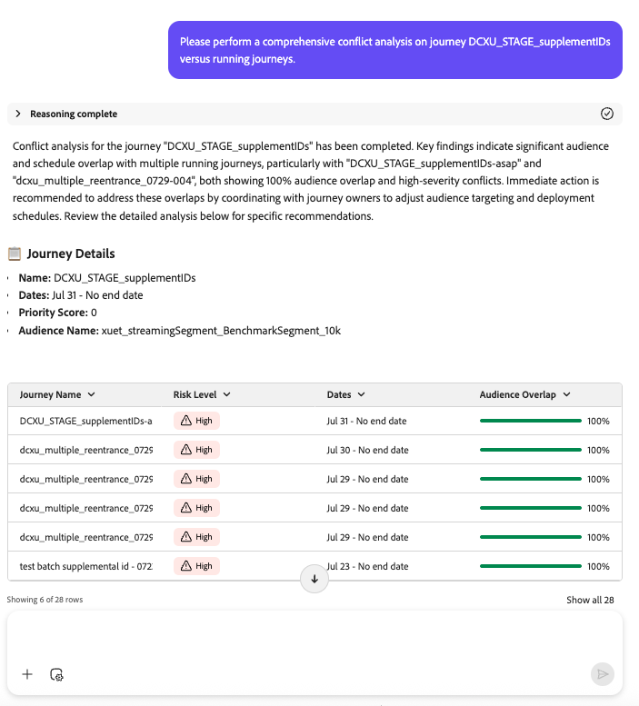

# Journey Analyze代理程式：技能概覽和使用手冊

## 概覽

Journey Agent可讓Journey Optimizer使用者使用自然語言介面來分析和最佳化歷程。 透過Journey Agent，從業人員可以快速識別並解決排程和/或對象衝突、偵測歷程中的使用者放棄點，並提供見解或建議。 它讓從業人員能夠進行資料導向式決策、改善客戶參與度並簡化歷程協調。

>[!AVAILABILITY]
>
>Journey Agent可供所有可存取AI Assistant的客戶使用。 但是，您需要下列許可權才能完整使用Journey Agent功能。
>
>**檢視歷程**：此許可權可讓您使用Journey Agent直接在AI助理中檢視歷程的深入分析。
>&#x200B;>**管理歷程**： 「收件者」許可權可讓您使用Journey Agent直接在AI助理中建立新的歷程。
>&#x200B;>**檢視區段**：此許可權可讓您使用Journey Agent直接在AI助理中檢視對象的深入分析。
>&#x200B;>**管理區段**： 「收件者」許可權可讓您使用Journey Agent直接在AI Assistant中建立新對象。

AJO代理程式的

## 使用案例

### Journey Agent Analytics的主要使用案例

Journey Agent分析技能提供一系列可用來最佳化行銷工作的功能：

1. **歷程流失分析**

   - 識別客戶在歷程中流失的位置及原因。
   - 偵測導致中斷參與的客戶行為模式。
   - 運用見解來調整歷程設計並提升保留率。

1. **歷程對象重疊分析**

   - 分析多個歷程中的受眾重疊。
   - 防止過度鎖定目標所造成的受眾疲勞。
   - 最佳化區段以確保平衡的參與。

1. **歷程排程重疊分析**

   - 偵測以相同對象為目標的已排程歷程之間的時間衝突。
   - 避免過度溝通，並提升排程效率。
   - 透過確保歷程在最佳時間執行，最大化對受眾的影響。

1. **營運分析**

   - 提示型歷程深入分析 — 顯示歷程的營運深入分析，即「顯示所有即時歷程」。

對於這些分析中的每一個，代理程式不僅會偵測問題，還會提供&#x200B;**可操作的建議來解決問題**。

## 範圍之內和範圍外技能

### 領域&#x200B;**中的**

Journey Agent Analyze支援下列功能：

- **被動式查詢**：允許使用者詢問關於歷程效能、對象使用情況和排程衝突的特定問題。
- **與其他代理程式整合**：與Audience Agent和Data Insights Agent共同作業，以進行更深入的分析。
- **代理程式回應結構**：推理（說明邏輯）、分析摘要（強調關鍵點）、問題詳細資訊（說明問題）以及建議（建議後續步驟）。

### **超出範圍**

目前不支援下列功能：

- **自動歷程建立**
- **即時異常偵測**
- **管道重疊**
- **歷程專案分析**
- **技術問題分析**
- **疲勞分析**

## 範例提示/範例提示

### 歷程分析的常見提示

以下是使用者可以利用來探索、監控和疑難排解其歷程的有價值提示範例。

### 歷程生命週期問題

- 「[歷程名稱]何時發佈？」
- 「[歷程名稱]何時停止？」
- 「列出目前處於測試模式的所有歷程」

### 歷程資源問題

- 「我有多少個即時歷程？」
- 「提供所有已排程的週期性歷程及其預期執行時間的清單。」

### 對象和歷程深入分析

- 「超過X個歷程會使用哪些對象？」
- 「使用[對象名稱]對象列出所有歷程。」

### 流失分析

- 「我想針對7月4日的行銷活動歷程依節點分析流失。」
- 「對7月4日的行銷活動歷程執行流失分析。」
- 「在7月4日行銷活動的歷程中，設定檔損失是多少？」
- 「顯示使用者在7月4日的行銷活動之旅中的目的地。」

### 衝突分析提示

使用這些提示來分析歷程之間的潛在衝突，包括排程和對象重疊：

- 「您可以使用即時/執行歷程的衝突型別（排程/對象）資訊，針對我們的歷程[歷程名稱]執行全面的衝突分析嗎？」
- 「請針對包含衝突型別資訊的歷程[歷程名稱]進行排程衝突分析。」
- 「請使用衝突型別資訊對歷程[歷程名稱]進行對象重疊分析。」
- 「歷程[歷程名稱]是否有任何排程衝突？」
- 「顯示歷程[歷程名稱]的對象重疊衝突。」
- 「分析歷程[歷程名稱]與其他即時歷程的所有衝突。」
- 「歷程[歷程名稱]目前有哪些衝突？」
- 「檢查歷程[歷程名稱]是否有對象與其他歷程衝突。」
- 「檢查與歷程[歷程名稱]相關的排程衝突。」
- 「我想瞭解[歷程名稱]的所有歷程衝突。」
- 「是否有任何即時歷程與排程或對象中的[歷程名稱]衝突？」
- 「識別歷程[歷程名稱]與執行中歷程的衝突型別。」
- 「顯示歷程[歷程名稱]和其他歷程的重疊對象。」
- 「醒目提示在歷程[歷程名稱]和即時歷程之間的排程重疊。」
- 「歷程[歷程名稱]是否與其他歷程發生衝突？」
- 「請偵測並列出[歷程名稱]的衝突。」
- 「報告歷程[歷程名稱]的所有衝突型別。」
- 「提供[歷程名稱]的衝突劃分（排程與對象）。」
- 「[歷程名稱]是否有任何可能影響效能的衝突？」
- 「是否有任何影響[歷程名稱]的有效衝突？」
- 「依排程或對象列出與[歷程名稱]衝突的歷程。」
- 「歷程[歷程名稱]是否已觸發任何衝突警示？」
- 「尋找歷程[歷程名稱]的潛在對象衝突。」
- 「分析歷程[歷程名稱]的衝突風險。」
- 「為[歷程名稱]提供衝突診斷。」

## 最佳實務

### 提示最佳實務

若要讓Journey Agent Analytics發揮最大效益，請遵循下列最佳作法：

1. **明確**：使用簡潔明瞭的提示來取得目標性的深入分析。 例如，與其問「我的歷程為何？」，改為指定「列出上個月建立的所有歷程」。
1. **結合深入分析**：整合Audience Agent和Data Insights Agent的深入分析，以取得歷程績效的整體檢視。
1. **反複細分**：使用流失和重疊分析，反複調整歷程設計和排程。

### 設定最佳實務

- **定義明確的目標**：在分析歷程之前，請先建立明確的目標（例如，改善保留率、增加轉換）。
- **定期監視**：排程定期審查歷程績效，以識別趨勢和異常。
- **最佳化細分**：確保對象細分平衡，以避免疲勞並最大化參與。