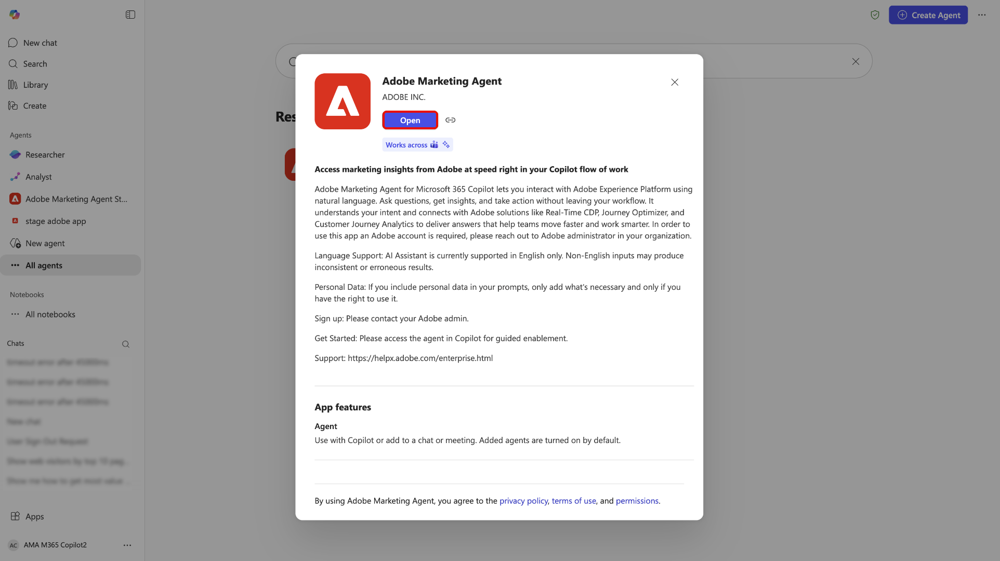
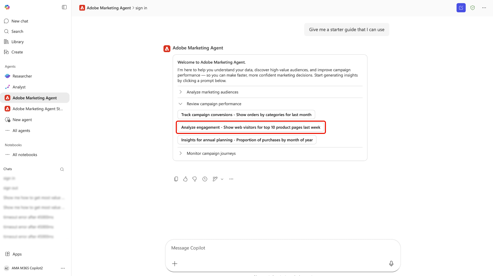

# [!DNL Microsoft 365 Copilot]的Adobe Marketing Agent

[!DNL Microsoft 365 Copilot]的Adobe Marketing Agent是AI支援的工具，可將Adobe Experience Platform直接連線至[!DNL Microsoft 365 Copilot]。 有了此代理程式，您可以在[!DNL Microsoft 365]應用程式（例如[!DNL Teams]、[!DNL Word]、[!DNL Powerpoint]和[!DNL Excel]）中詢問自然語言問題，以便立即從Experience Platform擷取行銷深入分析，而不會中斷您的工作流程。 這些應用程式中都有相同的代理程式，而且您與Adobe Marketing Agent的聊天記錄會延續 — 舉例來說，您可以在[!DNL Teams]中開始研究[!DNL Copilot]，並在[!DNL Word]或[!DNL Powerpoint]中繼續交談，同時草擬行銷活動簡報或檢閱簡報。

有了適用於[!DNL Microsoft 365 Copilot]的Adobe Marketing Agent，行銷經理、分析和見解團隊以及業務利害關係人可以：

- 做出更快、資料導向的行銷決策。
- 減少在工具之間切換所花費的時間。
- 簡化存取跨團隊的對象和歷程深入分析。

## 代理程式的運作方式

>[!IMPORTANT]
>
>適用於[!DNL Microsoft 365 Copilot]的Adobe Marketing Agent目前支援Experience Platform作業深入分析、Customer Journey Analytics資料深入分析、Audience Agent和Journey Agent。

適用於[!DNL Microsoft 365 Copilot]的Adobe Marketing Agent提供Experience Platform與[!DNL Microsoft 365]應用程式之間的整合式體驗：

- Adobe Marketing Agent在[!DNL Microsoft 365 Copilot]中顯示為代理程式，包括在[!DNL Teams]、[!DNL Word]、[!DNL Powerpoint]和[!DNL Excel]中。
- 使用您的Adobe帳戶登入，並選取您要使用的資料環境（沙箱、資料檢視）。

### 資料存取與許可權

您收到的回答反映與您的Adobe身分識別相連結的&#x200B;**資料與存取層級** — 您可以查詢和看到的內容，與您在Experience Platform及其相關解決方案中有權獲得的內容相同。 Adobe Marketing Agent **繼承**&#x200B;這些許可權，且&#x200B;**不**&#x200B;需要個別許可權設定才能進行[!DNL Microsoft 365]整合。 對於基礎的Experience Platform AI助理功能和其他Adobe AI代理程式，**許可權要求與在Experience Platform中使用這些功能相比沒有變更**。

代理程式會將您的[!DNL Microsoft 365]執行個體連線至Experience Platform及其相關應用程式（Real-Time CDP、Adobe Journey Optimizer和Customer Journey Analytics）。 透過這項整合，您就可以使用Experience Platform AI助理和代理程式，直接擷取您[!DNL Microsoft 365]執行個體的相關深入分析。 在[!DNL Microsoft 365]執行個體中傳回的答案會顯示為對話式及自然語言文字、表格和資料視覺效果。 此外，在同一[!DNL Copilot]聊天室中，也提供後續問題和調查的支援。

## 主要使用案例和範例情境

| 使用案例 | 說明 |
| --- | --- |
| 擷取對象和客戶歷程的營運深入分析 | 有了Adobe Marketing Agent，您可以輕鬆擷取對象和客戶歷程中的營運深入分析。 您可以識別哪些對象是最大或最參與，因此您可以優先在何處集中您的努力。 您可以檢視哪些客戶歷程目前作用中，並瞭解其成效如何，協助您找出最佳化的機會。 此代理程式也可讓您追蹤不同區段隨時間的成長或縮減情況，讓您能夠在對象動態變化發生時立即回應。 |
| 使用資料視覺效果來更好地分析客戶歷程和行銷活動 | 您可以檢視歷程績效和流失、比較一段時間內的行銷活動績效，並瞭解哪些接觸點可促進轉換。 此外，您可以產生行銷活動績效的視覺化報表，並在不同管道、地區或不同時段內比較這些報表。 您也可以探索趨勢，而無需手動建立查詢或控制面板。 |
| 強化共同作業與決策 | 使用建議的提示來探索對象、行銷活動和網路流量。 運用自然語言介面，更輕鬆地學習Experience Platform和Customer Journey Analytics概念。 此外，您還可以在規劃會議期間，分享[!DNL Teams]管道或聊天內容的相關見解。 您也可以在檢閱計畫或平台時，使用Adobe Marketing Agent即時回答臨時問題，好讓利害關係人能在同一組度量和定義上保持一致。 |

## 先決條件

在您可以將Adobe Marketing Agent用於[!DNL Microsoft 365 Copilot]之前，您必須先確定您有以下事項：

- [!DNL Microsoft 365]與[!DNL Microsoft Teams]或[!DNL Microsoft Copilot Chat]。
- Experience Platform和至少其中一個：Real-Time CDP、Adobe Journey Optimizer和/或Customer Journey Analytics。
- Experience Platform Agent Orchestrator和代理的權益。
- 存取貴組織的Adobe Experience Cloud帳戶（登入和產品權益），以取得您使用的解決方案和資料。 如果您沒有Adobe存取權，請聯絡Adobe管理員。

## 為您的組織啟用代理程式 {#enable-the-agent-for-your-organization}

只有在[!DNL Microsoft 365]租使用者中提供Adobe Marketing Agent後，一般使用者才能使用。 **與您的[!DNL Microsoft 365] Copilot系統管理員** （或貴組織中Copilot代理程式的同等系統管理員）合作，以啟用存取許可權並根據貴組織的需求指派代理程式。

管理員設定後的典型結果包括：

- 您可以在[!DNL Teams]中開啟&#x200B;**[!DNL Agent Store]**，在您的代理程式清單中找到&#x200B;**[!DNL Adobe Marketing Agent]**，並選擇&#x200B;**[!DNL Add]**&#x200B;將其附加至您的Copilot代理程式。
- 或者，您的Copilot管理員也可以&#x200B;**將代理程式**&#x200B;發佈給組織中的每個人或特定群組，讓使用者不需要個別新增該代理程式。

如需[!DNL Microsoft 365]管理中心的管理員步驟和原則選項，請參閱Microsoft檔案中的[管理Microsoft 365 Copilot的代理程式](https://learn.microsoft.com/en-us/microsoft-365-copilot/extensibility/manage)。

## 開始使用

在您的組織啟用代理程式後（請參閱[為您的組織啟用代理程式](#enable-the-agent-for-your-organization)），在您選擇的應用程式中導覽至[!DNL Microsoft 365 Copilot]，然後使用左側導覽來選取&#x200B;**[!DNL All Agents]**。

找到[!DNL Adobe Marketing Agent]的卡片，或使用搜尋列手動尋找代理程式。 取得代理程式後，請選取卡片。

使用快顯視窗瞭解更多有關代理程式的資訊。 準備就緒後，選取&#x200B;**[!DNL Add]**。

[!DNL Microsoft 365 Copilot]儀表板更新為[!DNL Adobe Marketing Agent]品牌，現在在主要頁面上。

### 登入並設定您的內容

接下來，提示代理程式登入，並依照後續驗證帳戶所需的步驟操作。 在此步驟中，您需要複製代理程式傳回的數位代碼，然後登入您的Adobe組織。 如果您無法完成登入或無法存取組織的Adobe解決方案，請連絡您的&#x200B;**Adobe管理員**。

成功後，使用內容設定器建立您將用於查詢的檔案來源、沙箱和資料檢視。

### 使用代理程式來擷取營運分析

登入後，您可以使用首頁面中提供的提示來開始。 您也可以利用入門提示，其可延伸至分析行銷對象、檢閱行銷活動績效及監控行銷活動歷程。 例如，選取&#x200B;**[!DNL Review campaign performance]**，然後選取&#x200B;**[!DNL Analyze engagement - Show web visitors for top 10 products last week]**。

讓代理程式花一些時間進行計算，然後代理程式會以視覺化的資料呈現方式回應。 您可以使用顯示的長條圖，也可以選取&#x200B;**[!DNL View data]**&#x200B;以檢視表格中的資料。

您可以選取代理程式建議的後續追蹤問題來進行進一步調查。 或者，您可以旋轉並嘗試不同的起始提示、驗證代理程式參考的資訊來源，或使用意見反應機制提供意見反應。

如需有關AI助理UI功能的詳細資訊，請參閱[使用AI助理](../ai-assistant/ai-assistant-ui.md)的指南。

## 安全性、隱私權和負責的AI

**資料處理與控管**

Adobe Marketing Agent所依賴的控制和治理與Experience Platform和[!DNL Microsoft 365]相同。 您的組織保留對其資料的所有權和控制權。 透過代理程式傳回的深入分析範圍設定為每位使用者的Adobe許可權和資料權益；除了已在Experience Platform和相關Adobe AI代理程式中套用的許可權，不會為[!DNL Microsoft 365]表面引進其他許可權模型。

**負責的AI使用**

此代理程式旨在傳回唯讀深入分析，不會在Experience Platform中修改您的客戶資料。 您應先檢閱任何產生的摘要和分析，再使用這些摘要和分析來做出業務決策。

**支援的語言和範圍**

初始版本提供英語體驗。 功能僅限於唯讀深入分析；代理程式不會建立或更新行銷資產或設定。

>[!IMPORTANT]
>
>Adobe Marketing Agent會根據提交的提示叫用不同的Adobe代理程式和作業。 這個被叫用的基礎Adobe代理程式會利用[Adobe Experience Platform代理程式工作和AI積分消耗](https://experienceleague.adobe.com/en/docs/core-services/interface/features/ai-credit-consumption)頁面中指示的AI積分。

## 附錄

請閱讀下列內容，以瞭解[!DNL Microsoft 365 Copilot]的Adobe Marketing Agent其他資訊。

### Adobe Marketing Agent [!DNL Microsoft 365 Copilot]管理步驟

若要從外部提供者（協力廠商開發人員或Microsoft Commercial Marketplace）設定代理程式，您必須先確保租使用者設定允許外部應用程式，然後透過管理中心的整合式應用程式或代理程式區段管理這些應用程式。

#### 在租使用者設定中啟用外部代理

部署外部代理之前，貴組織的原則必須允許他們。

- 登入[Microsoft 365系統管理中心](https://admin.microsoft.com/)。
- 移至&#x200B;**代理程式** > **設定** > **使用者存取**。
- 在&#x200B;**允許的代理程式型別下，**&#x200B;確定已選取&#x200B;**允許外部發行者建置的應用程式和代理程式**。

>[!IMPORTANT]
>
>如果停用此設定，外部代理將不會出現在使用者的[代理程式存放區](https://devblogs.microsoft.com/microsoft365dev/introducing-the-agent-store-build-publish-and-discover-agents-in-microsoft-365-copilot/)中。

#### 取得及核准代理程式

通常您可以在[[!DNL Microsoft Commercial Marketplace]](https://appsource.microsoft.com/)中找到外部代理程式。

- **從Marketplace**：尋找您想要的代理程式並選取&#x200B;**立即取得**。 這通常會重新導向您回到系統管理中心的&#x200B;**整合式應用程式**&#x200B;頁面。
- **檢閱許可權**：在[整合式應用程式](https://learn.microsoft.com/en-us/microsoft-365/admin/manage/manage-deployment-of-add-ins?view=o365-worldwide)清單中，選取外部代理程式。
- 檢閱&#x200B;**資料與工具**&#x200B;與&#x200B;**安全性與合規性**&#x200B;標籤，瞭解外部提供者將存取哪些資料。
- 選取「**核准**」或「**啟用**」以將其移至您組織的詳細目錄。

#### 部署至特定使用者

核准後，您就可以精確地控制哪些人在其Copilot側邊欄中看到代理程式。

- 在[[!DNL Microsoft 365] 系統管理中心](https://admin.microsoft.com/)，瀏覽至&#x200B;**代理程式** > **所有代理程式**。
- 從清單中選取外部代理。
- 選取&#x200B;**部署** （或&#x200B;**編輯工作分派**）。
- 選擇&#x200B;**特定使用者/群組**，然後搜尋應該擁有該群組的個人或[!DNL Entra ID]群組。
- 選取&#x200B;**完成部署**。 這會將代理程式「推送」給這些使用者，使其自動出現在他們的Copilot介面中。

#### 管理更新

外部提供者經常更新其代理。 若要管理這些更新，請遵循以下最佳實務：

- 定期檢查[[!DNL Agent Registry]](https://learn.microsoft.com/en-us/microsoft-365/admin/manage/agent-registry?view=o365-worldwide)。
- 如果更新需要新許可權，代理程式可能會顯示&#x200B;**擱置更新**&#x200B;的狀態。
- 您必須手動&#x200B;**核准更新**，新版本才會轉出給指派的使用者。