# Audience 代理

>[!AVAILABILITY]
>
>Audience Agent可供所有可存取AI Assistant的客戶使用。 但是，您需要下列許可權才能完整使用Audience Agent功能。
>
>**檢視區段**：此許可權可讓您使用Audience Agent直接在AI助理中檢視對象的深入分析。
>
>**管理區段**： 「收件者」許可權可讓您使用Audience Agent直接在AI Assistant中建立新對象。

Audience Agent可讓您檢視對象的相關深入分析，包括偵測對象人數的重大變更、偵測重複的對象、探索您的對象詳細目錄，以及擷取對象人數。

>[!SLIDE](audience-agent-overview)

## 支援的使用案例

AI Assistant中的Audience Agent支援下列使用案例：

- 以對話方式探索您的對象
   - 尋找現有對象的對象大小
   - 根據完整的或部分屬性來尋找對象，命名為
   - 偵測重複的對象
   - 探索可用來定義對象的XDM欄位
- 偵測對象人數的重大變更
   - 這可讓您找到突然增加或減少的受眾，讓您更好地分析潛在的市場變化
- 建立客群
   - 此技能可讓您根據指定的屬性和事件建立對象
   - 此外，此技能可讓您在建立受眾之前估計受眾的潛在大小，讓您在準備好啟用受眾之前快速迭代最有效的受眾

<!-- - Find your audience size and detect significant changes in audience size
  - This lets you find audiences that have suddenly grown or shrunk, letting you better analyze potential market changes
- Detect duplicate audiences
  - This lets you reduce redundancies with your created audiences
- Find audiences based on full or partial attributes named
  - This lets you more easily navigate through your audience inventory
- Discover XDM fields you can use to define an audience
  - This skill lets you more easily identify the right fields to use in your audience based on context and relevance -->

Audience Agent **目前**&#x200B;不支援下列功能：

- 目標型對象探索
   - 目標型對象探索可讓您套用機器學習模型（例如購買或轉換傾向），以探索與業務目標一致的相關資料集和設定檔。

此外，使用Audience Agent時，您應牢記下列限制：

- Audience Agent需要至少24小時來處理您的資料
   - 例如，您&#x200B;**無法**&#x200B;有一個查詢在過去24小時內尋找資料。 您至少需要檢視過去48小時內的狀況。
- Audience Agent僅支援下列對象型別：
   - 使用批次細分評估的&#x200B;**以人物為基礎的**&#x200B;對象
   - 下列使用案例的&#x200B;**以帳戶為基礎的**&#x200B;對象：
      - 對話式受眾探索
      - 重複對象偵測

## 範例提示

下列範例示範Audience Agent的範例提示和回應。

### 對話式受眾探索

為我顯示富裕買家的欄位。

+++ 回應

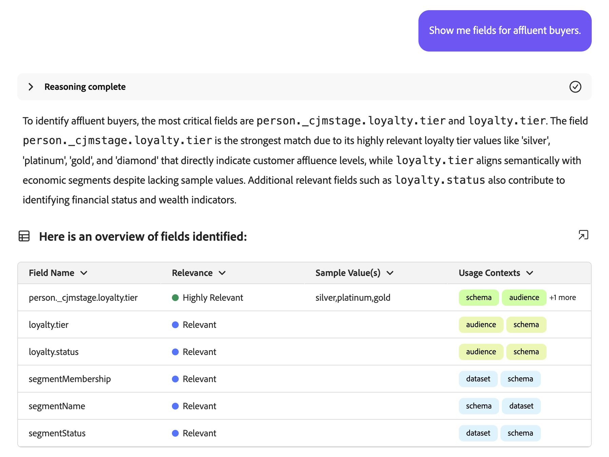

+++

在過去30天內，哪些對象尚未啟用或用於任何行銷活動？

+++ 回應

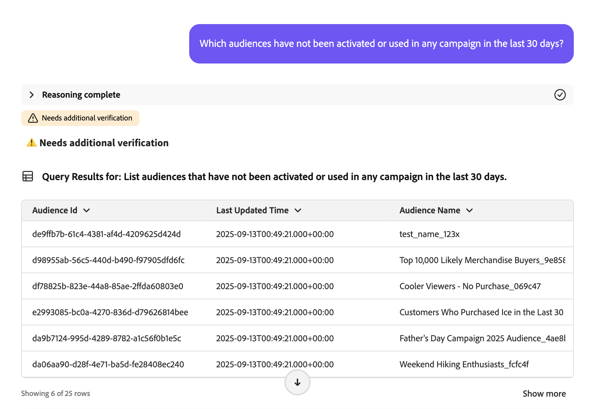

+++

列出過去3個月內已對應到新目的地的全部對象。

+++ 回應

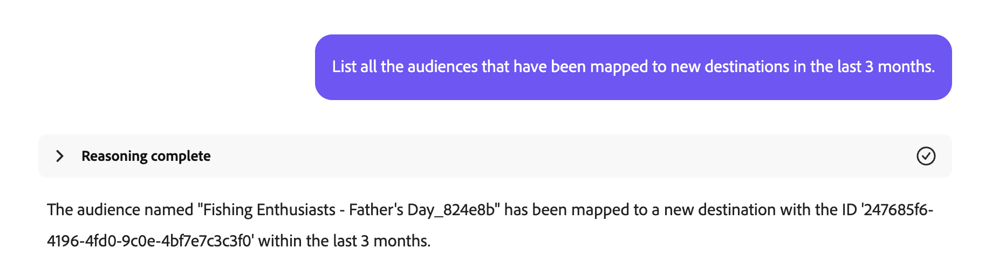

+++

哪個帳戶對象的對象人數最多，該人數為何？

+++ 回應

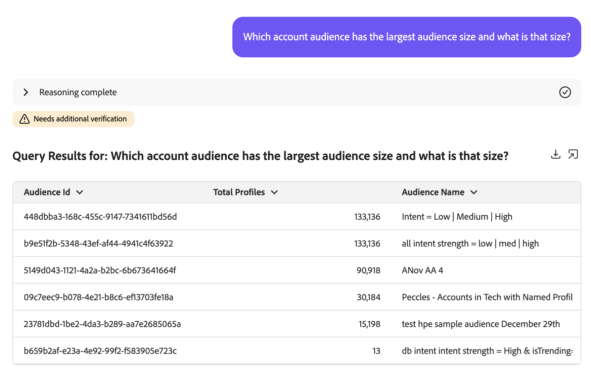

+++

### 偵測重複的對象

我是否有任何對象具有相同或類似的說明？

+++ 回應

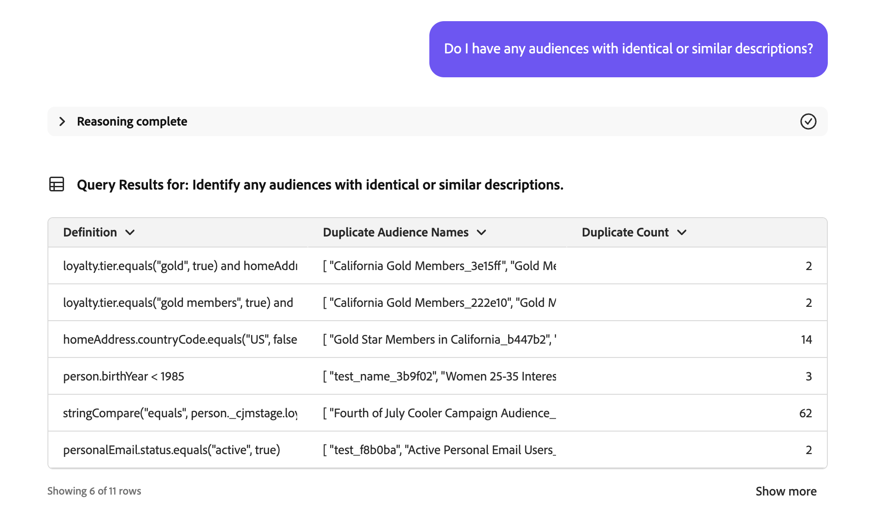

+++

識別具有相同規則但名稱不同的對象。

+++ 回應


+++

顯示具有相同規則但不同啟用目的地的所有對象。

+++ 回應

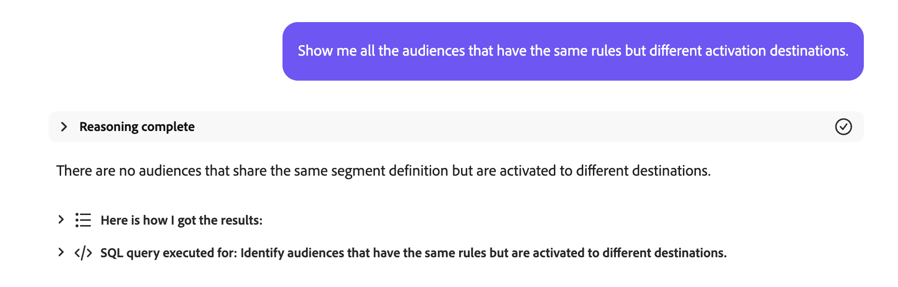

+++

識別具有相同規則但名稱不同的帳戶對象。

+++ 回應

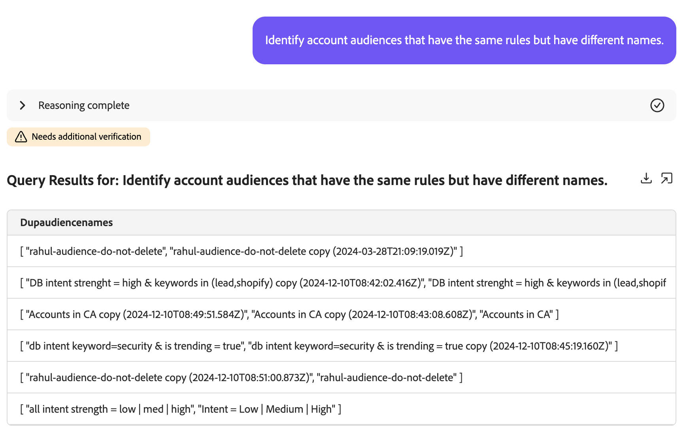

+++

### 擷取對象規模

我的對象「加州金星會員_f153e1」目前的大小為何？

+++ 回應

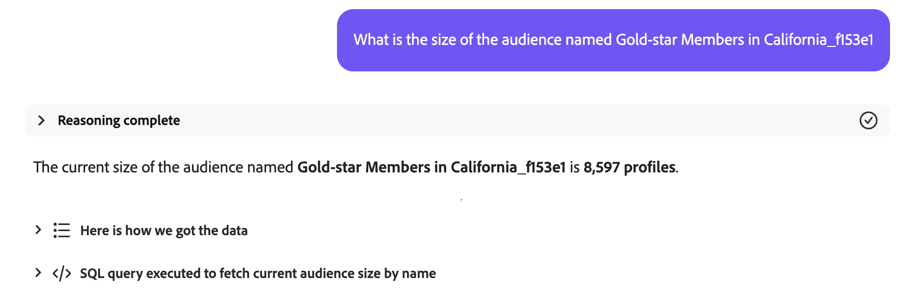

+++

我的最大受眾為何？

+++ 回應

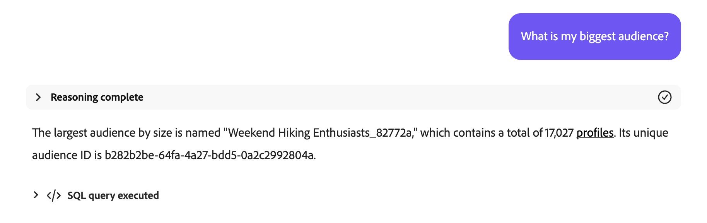

+++

### 偵測對象人數的重大變更

上週哪些對象的大小增加超過20%？

+++ 回應

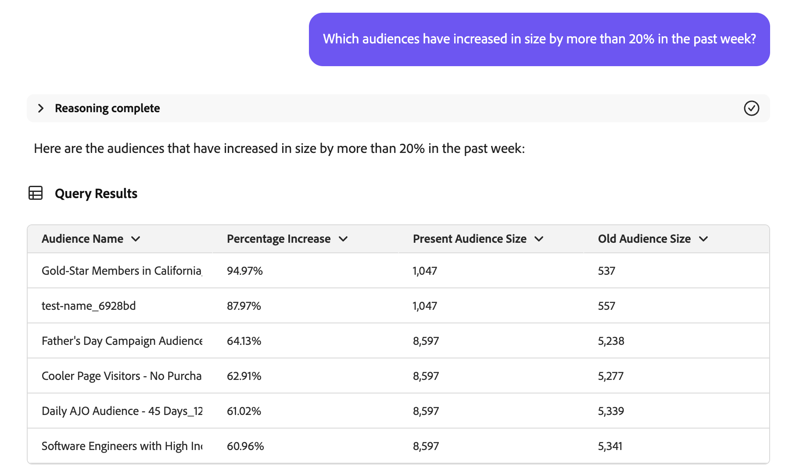

+++

上個月有哪些對象的大小減少了超過10%？

+++ 回應

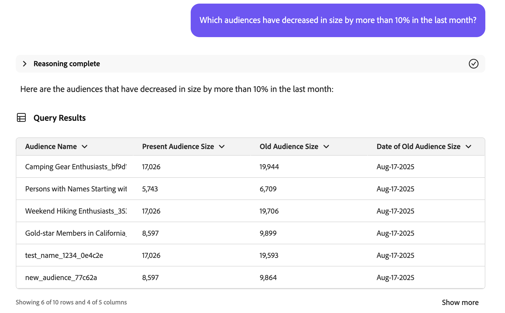

+++

我增長最快的對象是哪個？

+++ 回應

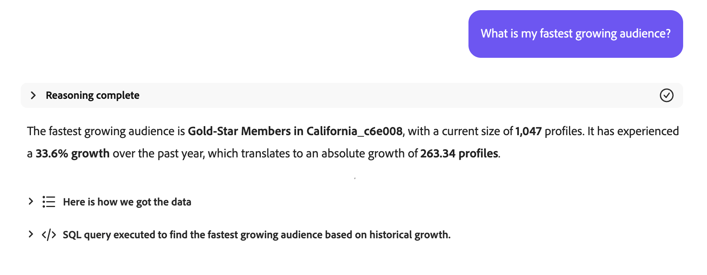

+++

### 建立客群

>[!AVAILABILITY]
>
>如果您是Agent Orchestrator Explorer程式的一部分，則只能使用建立對象技能。 如需詳細資訊，請聯絡Adobe客戶服務。

當您使用Audience Agent建立對象時，AI助理會引導您完成計畫。 例如，您可以要求「建立由住在加州的人組成的對象」。 AI Assistant接著會列出建立對象所要執行的計畫。

+++ 回應

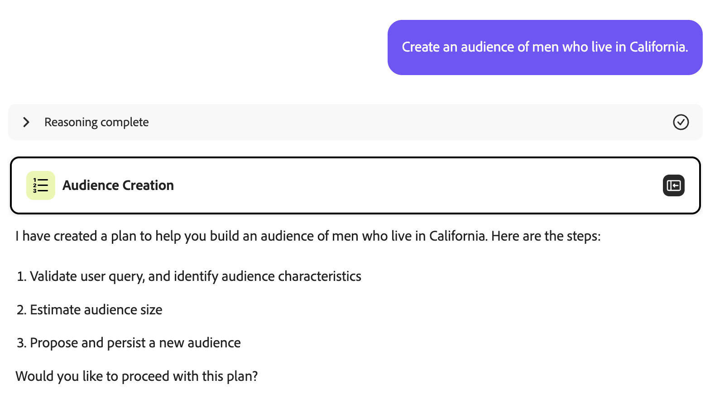

+++

此計畫包含三個步驟：

1. [識別對象特性](#identify)
2. [預估對象規模](#estimate)
3. [建立及保留新對象](#create)

#### 識別對象特性 {#identify}

{align="center" width="80%"}

接受計畫後，AI Assistant將根據您最初的查詢擷取對象特性。

+++ 回應

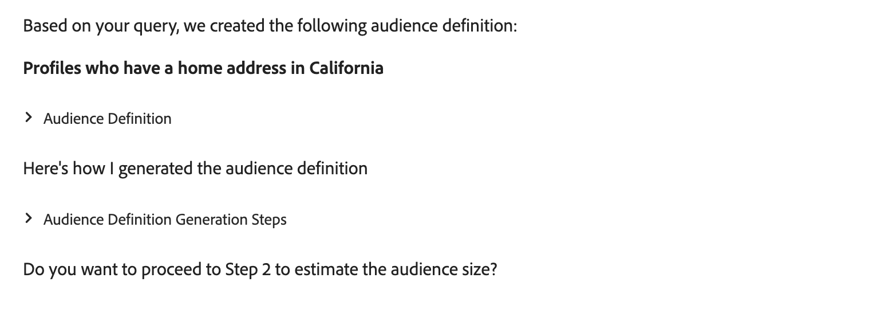

針對此查詢，AI Assistant會產生相關的Profile Query Language (PQL)，以尋找住在加州的人。 在此使用案例中，PQL查詢看起來會像這樣：

```sql
homeAddress.state.equals("California", false)
```

如需PQL的詳細資訊，請閱讀[PQL概觀](https://experienceleague.adobe.com/en/docs/experience-platform/segmentation/pql/overview)。

+++

如果AI助理的對象定義正確，您就可以核准並繼續下一步驟。

#### 預估對象規模 {#estimate}

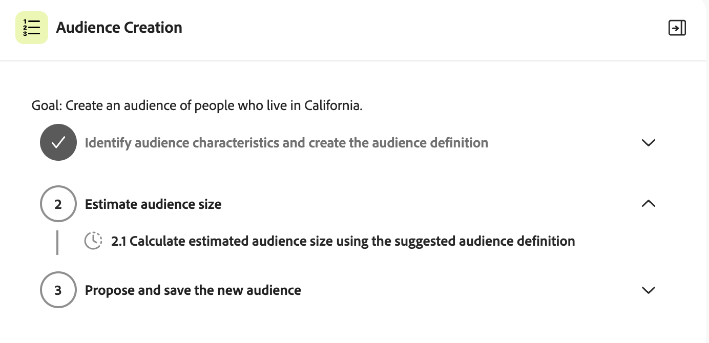{align="center" width="80%"}

在核准已識別的對象特性後，AI助理將會估計潛在對象的大小和對象定義詳細資訊。

+++ 回應

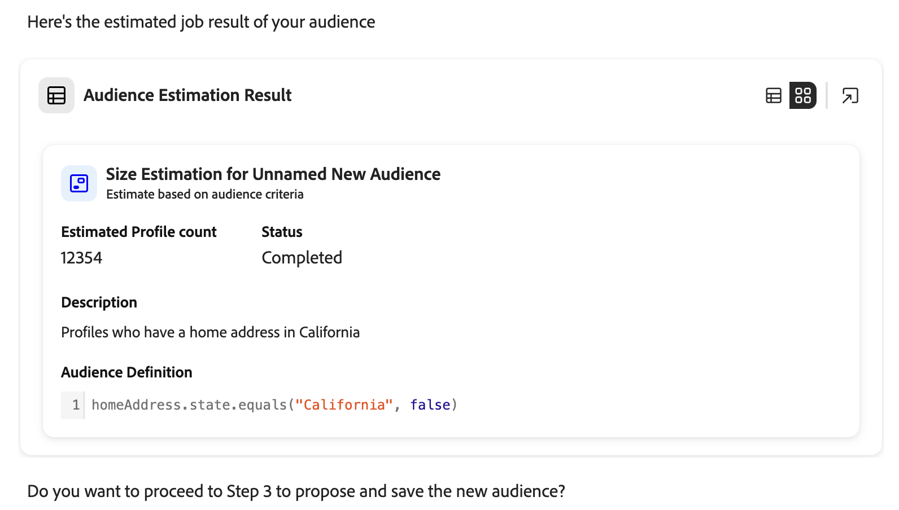

+++

如果預估大小看起來正確，您可以核准並繼續下一步驟。

#### 建立及保留新對象 {#create}

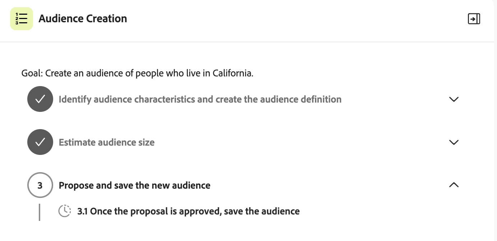{align="center" width="80%"}

最後，如果特徵和對象人數看起來正確，您可以核准或拒絕對象的建立。

+++ 回應

首先，您可以透過提供的資料格來檢閱建議對象。


如果對象看起來正確，您可以選取&#x200B;**[!UICONTROL 建立]**&#x200B;來接受提案，以完成建立對象。

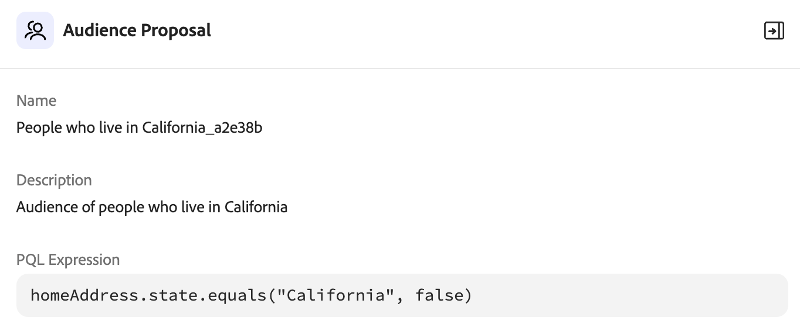

+++

對象現在已建立。

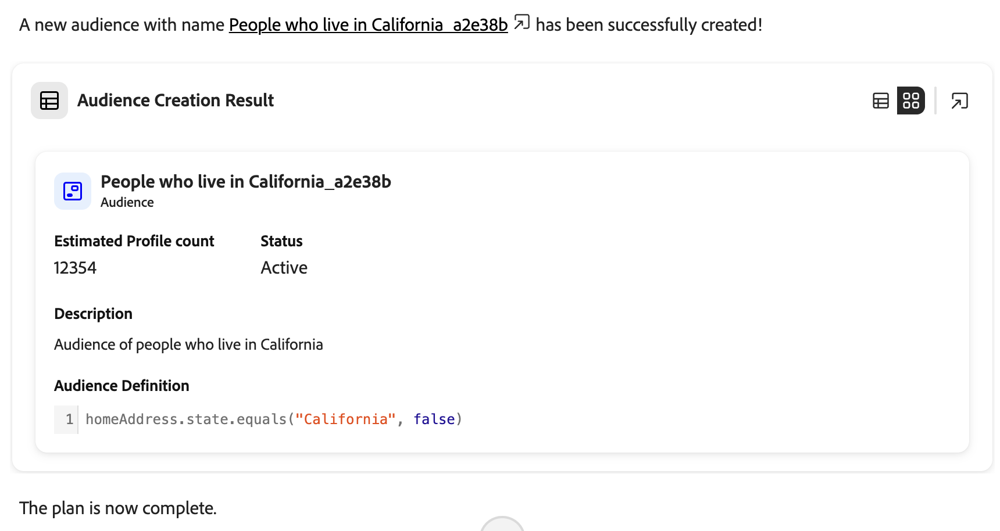{align="center" width="80%"}

## 後續步驟

閱讀本指南後，您應該對Audience Agent及其支援的功能有更深入的瞭解。 如需Adobe Experience Platform代理程式的詳細資訊，請閱讀[Agent Orchestrator概觀](./agent-orchestrator.md)。

