# AI 助理

AI Assistant是一款智慧型交談、創造性的AI工具，可大幅提升生產力並重新定義Adobe Experience Platform應用程式中的工作。 您可以使用AI助理來存取Adobe Experience Platform代理程式和其他AI功能。

請閱讀本指南以瞭解如何使用AI助理。

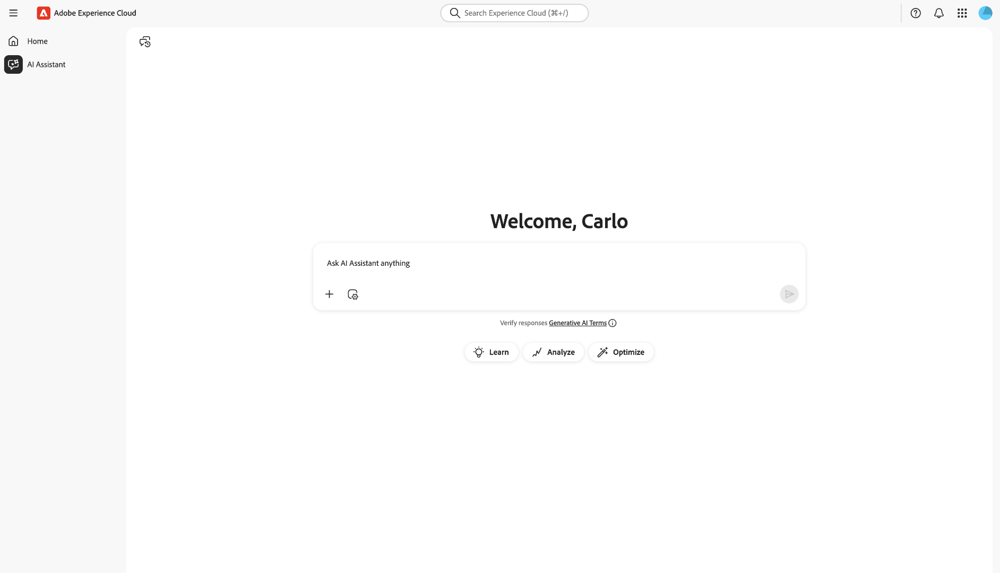

>[!SLIDE](agent-orchestrator-ui)

## 存取 AI 助理

有幾種方式可存取AI助理。

在Experience Cloud首頁介面中，從左側導覽選取&#x200B;**[!UICONTROL AI小幫手]**&#x200B;以啟動AI小幫手的全熒幕檢視。

+++選取以檢視

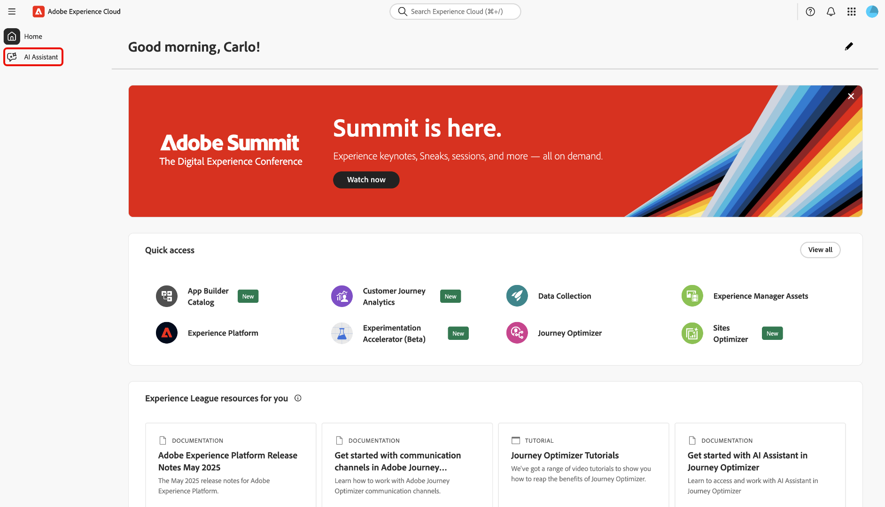

+++

您也可以從Experience Cloud應用程式(例如Experience Platform、Adobe Journey Optimizer和Customer Journey Analytics)的首頁啟動AI助理。 導覽至您的產品首頁，然後從頂端標題選取&#x200B;**AI助理圖示**，以啟動右側邊欄的AI助理聊天面板。

+++選取以檢視

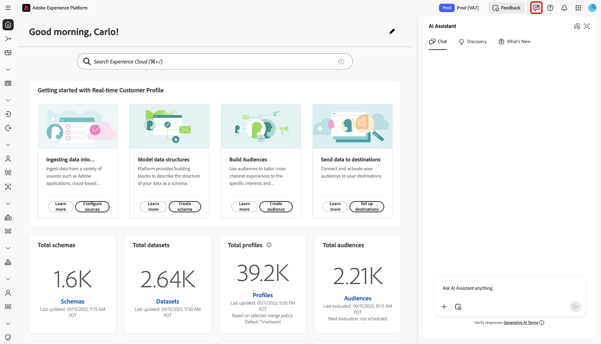

+++

## 瀏覽AI助理使用者介面

請參閱本節，瞭解如何導覽AI助理介面。

### 全熒幕檢視

AI Assistant介麵包含數個關鍵元素，可幫助您有效互動：

1. **[!UICONTROL 交談]**：選取&#x200B;**[!UICONTROL 交談]**&#x200B;圖示以開始新的交談，並從您的歷程記錄存取最近的交談。 如需詳細資訊，請閱讀有關[交談](#conversations)的章節。
2. **輸入方塊**：選取輸入方塊以輸入AI助理的問題和提示。 如需詳細資訊，請閱讀有關[輸入功能](#input-features)的章節。
3. **資料與物件自動完成**： — 選取加號圖示以使用資料與物件建議並自動完成。 選取後，您可以使用彈出式視窗來選取建議的實體。 如需詳細資訊，請閱讀有關[資料與物件自動完成](#autocomplete)的章節。
4. **內容設定**： — 選取[內容設定]圖示來設定AI助理的資訊來源。 您可以使用此工具來設定AI助理參考的應用程式、沙箱和資料檢視，以回答您的查詢。 如需詳細資訊，請閱讀[內容設定](#context-setting)的區段。
5. **探索**： — 選取&#x200B;**[!UICONTROL 學習]**、**[!UICONTROL 分析]**&#x200B;和&#x200B;**[!UICONTROL 最佳化]**&#x200B;以檢視您可用來開始使用的範例查詢。 如需詳細資訊，請閱讀[可發現性提示](#discoverability-prompts)的區段。

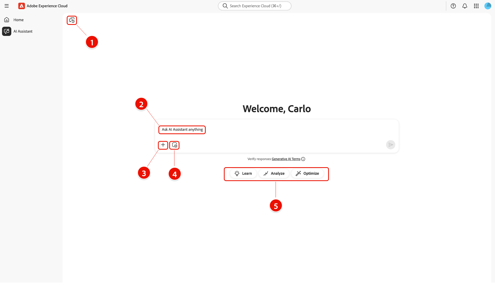

### 邊欄檢視

邊欄檢視可在精簡的面板中快速存取聊天、探索提示、更新、交談和介面控制項。

1. **[!UICONTROL 聊天]**：從標題選取&#x200B;**[!UICONTROL 聊天]**，在您離開時返回您的交談，以存取介面上的不同元素。
1. **[!UICONTROL 探索]**：選取&#x200B;**[!UICONTROL 探索]**&#x200B;以檢視依類別組織的AI助理提示清單。 您可以使用這些預先設定的提示來填入您的聊天。 此外，您可以調整建議的提示以符合您的特定使用案例。
1. **[!UICONTROL 新增功能]**：選取&#x200B;**[!UICONTROL 新增功能]**&#x200B;以檢視AI助理可用的最新更新清單。
1. **[!UICONTROL 交談]**：選取&#x200B;**[!UICONTROL 交談]**&#x200B;圖示以開始新的交談，並從您的歷程記錄存取最近的交談。 如需詳細資訊，請閱讀有關[交談](#conversations)的章節。
1. **全熒幕檢視**：選取&#x200B;**[!UICONTROL 全熒幕檢視]**&#x200B;圖示，將AI助理介面從右邊欄變更為全熒幕模式。
1. **資料與物件自動完成**：選取加號圖示以使用資料與物件建議並自動完成。 選取後，您可以使用彈出式視窗來選取建議的實體。 如需詳細資訊，請閱讀有關[資料與物件自動完成](#autocomplete)的章節。
1. **內容設定**：選取[內容設定]圖示以設定AI助理的資訊來源。 您可以使用此工具來設定AI助理參考的應用程式、沙箱和資料檢視，以回答您的查詢。 如需詳細資訊，請閱讀[內容設定](#context-setting)的區段。

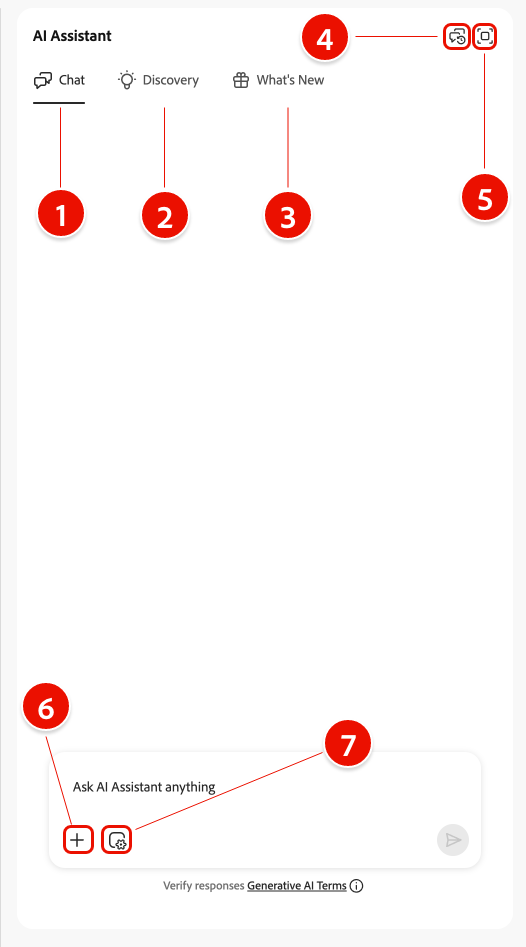

## AI助理使用者介面指南

本節提供AI助理使用者介面中主要功能和導覽選項的概觀。 說明如何存取AI助理，說明全熒幕和邊欄檢視的版面和控制項，並介紹對話、輸入功能、自動完成、內容設定和探索提示等關鍵工具。 以下幾節提供使用這些功能與AI助理互動並充分利用您的體驗的詳細指引。

### 探索提示 {#discovery-prompts}

您可以使用AI Assistant的探索功能，檢視AI Assistant支援的一般主體清單（群組為實體）。 探索提示會因您的起點而有所不同。

>[!BEGINTABS]

>[!TAB 從全熒幕檢視使用探索]

從全熒幕檢視中，探索提示分為三個類別： **[!UICONTROL 學習]**、**[!UICONTROL 分析]**&#x200B;和&#x200B;**[!UICONTROL 最佳化]**。

若要使用探索提示來提升產品知識，請選取&#x200B;**[!UICONTROL 學習]**，然後從出現的下拉式視窗中選取提示。

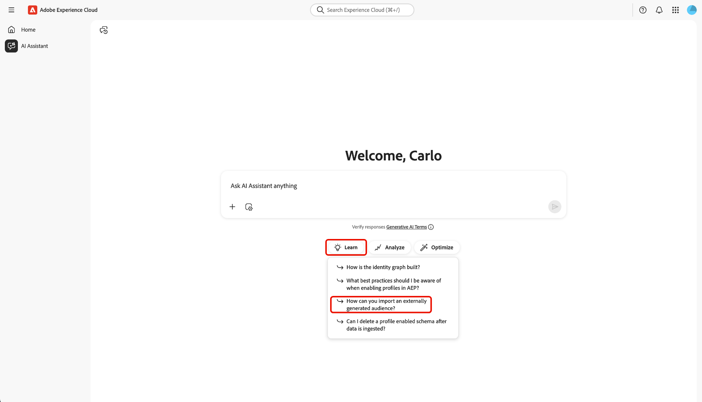

>[!TAB 使用邊欄檢視的探索]

從邊欄檢視中選取&#x200B;**[!UICONTROL 探索]**，即可存取廣泛的探索提示清單，供您用來開始使用，並填入AI助理的聊天。

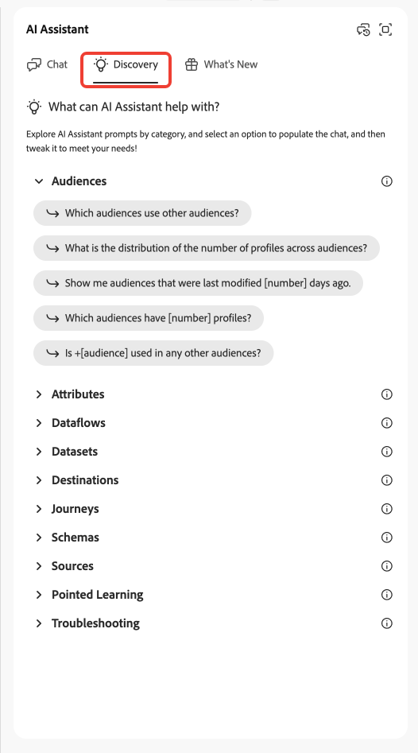

>[!ENDTABS]

選取提示以填入輸入方塊。 從這裡，您可以編輯提示以適合您的特定使用案例。 準備就緒後，選取右側的傳送圖示以提交您的查詢。

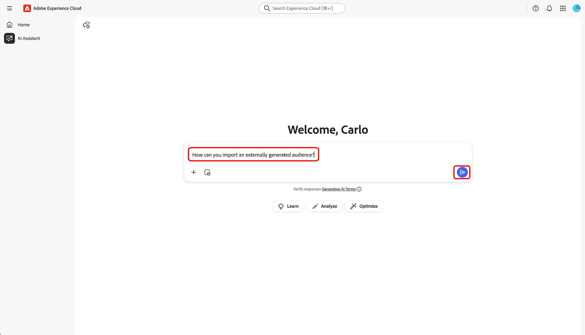

## 與回應互動

### 檢查推理過程 {#reasoning}

AI Assistant接著會查詢其知識庫並計算答案。 幾分鐘後，AI Assistant會傳回答案，包括深入探究其推理程式、相關建議、資訊來源和意見回饋工具的選項。

若要深入瞭解基礎推理程式，請選取&#x200B;**[!UICONTROL 推理完成]**。

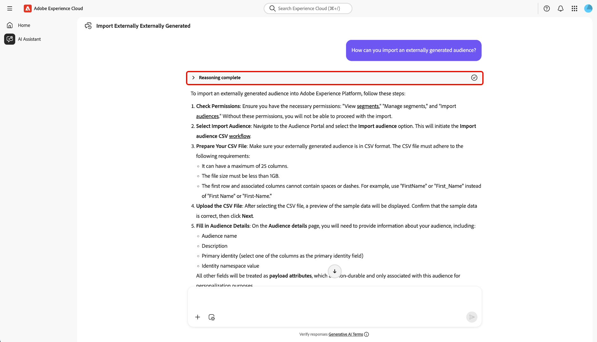

「*[!UICONTROL 推理完成]*」視窗會展開，顯示您要求的摘要以及建立回應的詳細資訊。

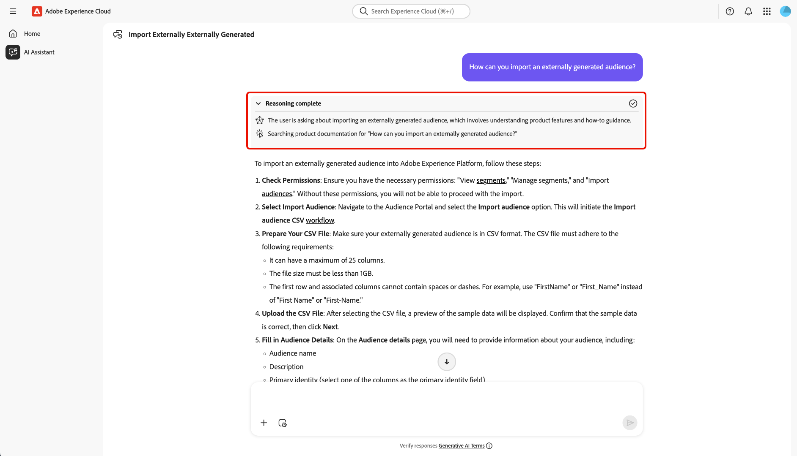

### 使用相關建議

接著，向下瀏覽至回應底部，並選取&#x200B;**[!UICONTROL 相關建議]**，以接收與初始查詢相關的提示清單。 您可以使用這些提示繼續與AI助理的對話。

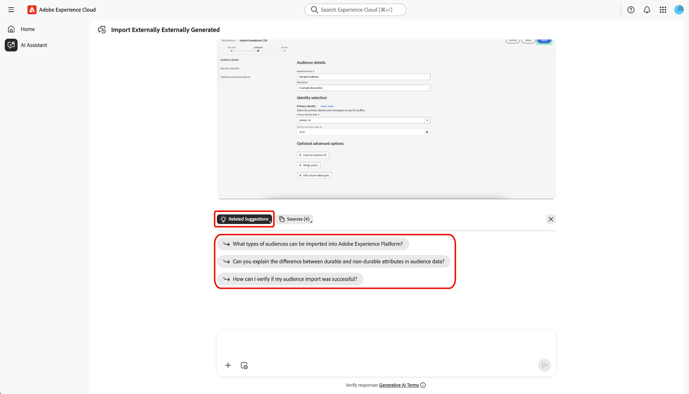

### 檢視來源

若要驗證AI助理的回應，請選取&#x200B;**[!UICONTROL 來源]**&#x200B;以檢視AI助理計算其回應時所參考的資訊來源清單。

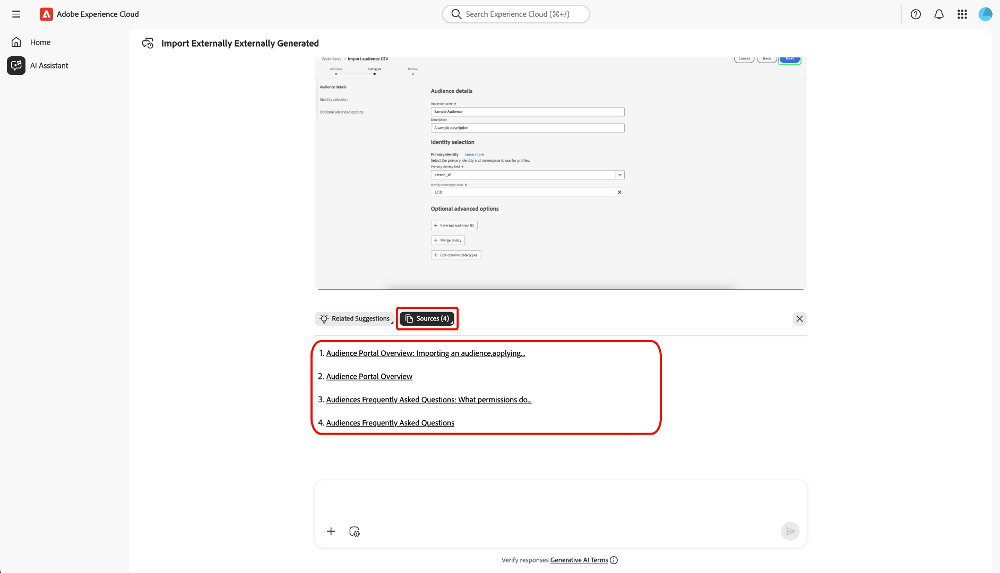

### 提供意見反應

您可以使用回答中提供的選項，針對AI助理的體驗提供意見回饋。

若要提供意見回饋，請在收到AI Assistant的回應後選取向上或向下拇指，然後在提供的文字方塊中輸入您的意見回饋。

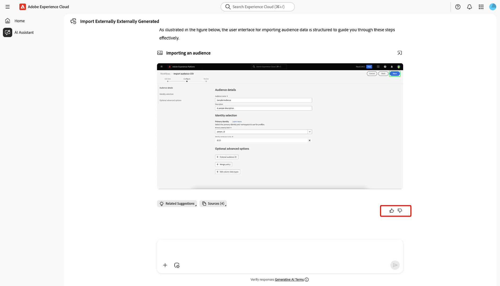

>[!BEGINTABS]

>[!TAB 縮圖向上]

選取&#x200B;**[!UICONTROL 向上縮圖]**&#x200B;以提供正面回饋。 您可以選擇從正面意見清單中選取，或使用輸入方塊輸入您自己的特定意見。

+++選取以檢視

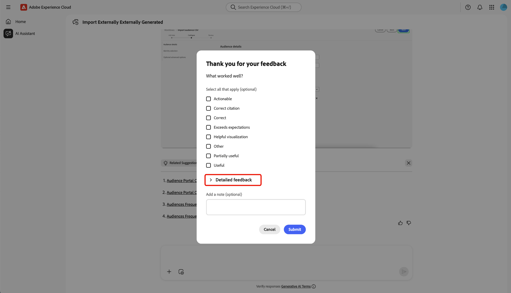

您也可以選取&#x200B;**[!UICONTROL 詳細的意見反應]**，進一步說明您的意見反應。 完成後，選取&#x200B;**[!UICONTROL 提交]**。

+++

>[!TAB 縮圖已關閉]

選取&#x200B;**[!UICONTROL 向下縮圖]**&#x200B;以提供建設性的意見回饋。 您可以選擇性地從建構性意見清單中選取，或使用輸入方塊輸入您自己的特定意見。

+++選取以檢視

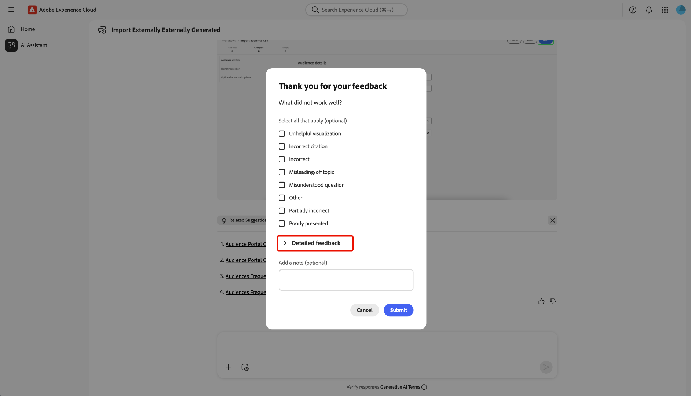

同樣地，您也可以選取&#x200B;**[!UICONTROL 詳細的意見反應]**，進一步說明您的意見反應。 完成後，選取&#x200B;**[!UICONTROL 提交]**。

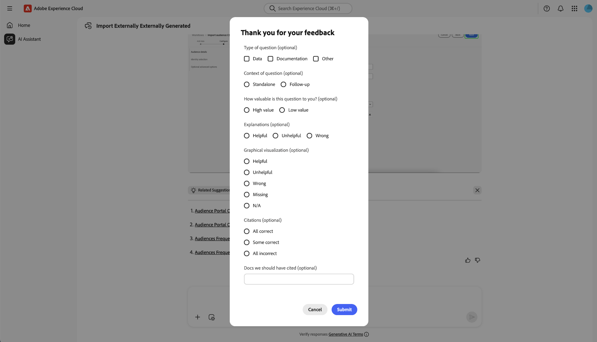

+++

>[!ENDTABS]

### 使用分割檢視功能

如果AI助理的回應包含影像，您可以選取路徑圖示來啟動分割檢視模式。 這可讓您透過右側顯示的內容影像，讀取AI助理的全部回應。

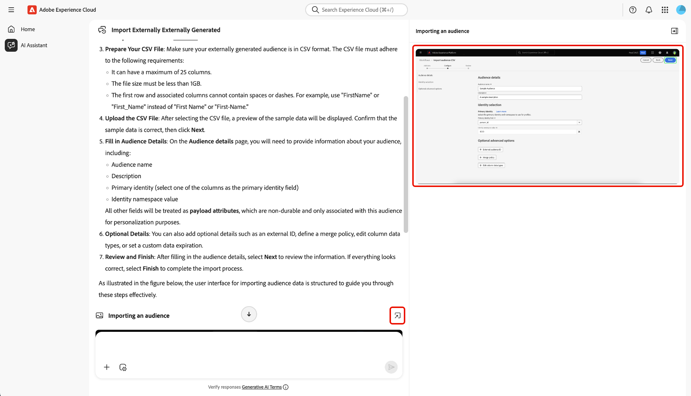

### 交談

您可以使用&#x200B;*[!UICONTROL 所有交談]*&#x200B;面板來重設和重新造訪與AI助理的交談。 選取&#x200B;**[!UICONTROL 交談]**&#x200B;圖示以檢視&#x200B;*[!UICONTROL 所有交談]*&#x200B;視窗。

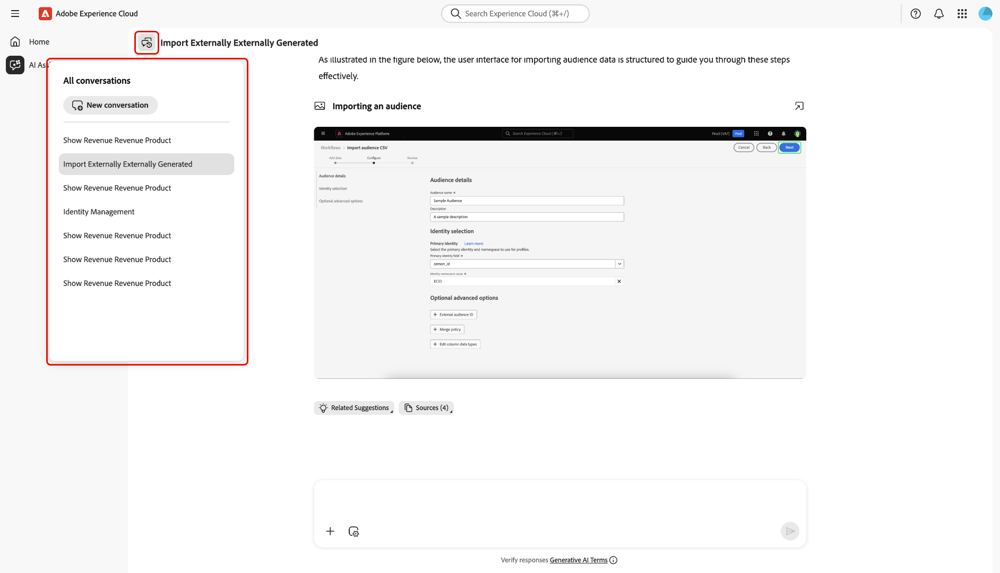

若要重新造訪先前的交談，請從提供的清單中選取交談主題。

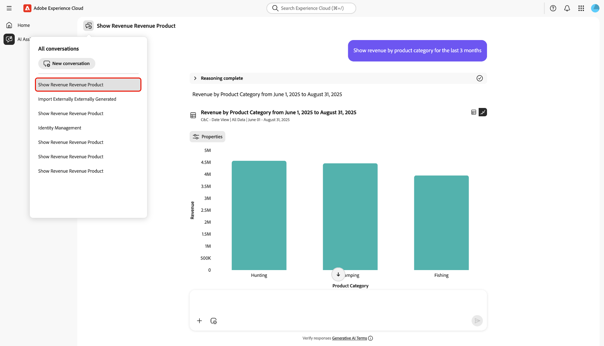

若要開始新交談，請選取&#x200B;**[!UICONTROL 新交談]**。

![已選取[新交談]選項。](./images/ai-assistant/conversations/new-conversation.png)

### 內容設定 {#context-setting}

使用AI助理的內容設定功能來設定AI助理參考以回答您的查詢的&#x200B;**應用程式**、**沙箱**&#x200B;和&#x200B;**資料檢視**。 若要存取內容設定，請從輸入方塊中選取&#x200B;**[!UICONTROL 內容設定]**&#x200B;圖示。

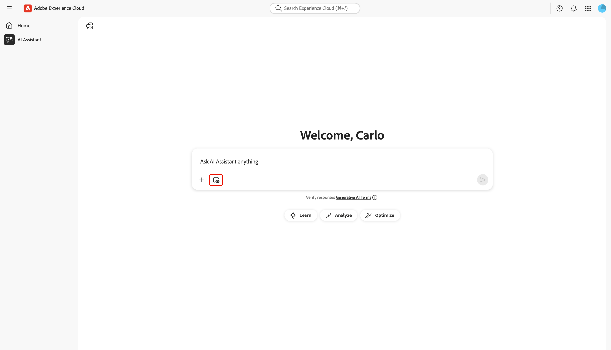

*[!UICONTROL 回應來源……]*&#x200B;快顯視窗會出現。 使用此視窗來設定您要使用的資訊來源，然後選取&#x200B;**[!UICONTROL 設定內容]**。

| 資訊來源 | 說明 | 範例 |
| --- | --- | --- |
| 應用程式 | 您查詢所屬的Experience Cloud應用程式。 | Experience Platform、Journey Optimizer、Customer Journey Analytics等 |
| 沙箱 | 包含您的查詢相關資料集或資訊的沙箱。 | 生產(VA7)、開發 |
| 資料檢視 | 當您搭配使用AI助理與Customer Journey Analytics時，資料檢視設定可協助Data Insights Agent瞭解： <ul><li>要查詢的資料集</li><li>有哪些可用的資料元件</li><li>如何建構有關您資料的回應</li><li>要在Analysis Workspace中建立哪些視覺效果</li></ul> |

![可設定資訊來源的[回答]面板。](./images/ai-assistant/inputs/answer-from.png)

### 資料和物件自動完成

您可以使用自動完成函式來接收沙箱中存在之資料物件的清單。 若要使用自動完成，請在查詢中輸入加號圖示(+)。 或者，您也可以選取文字輸入方塊底部的加號圖示(+)。 隨即顯示一個視窗，其中包含沙箱中建議的資料物件清單。

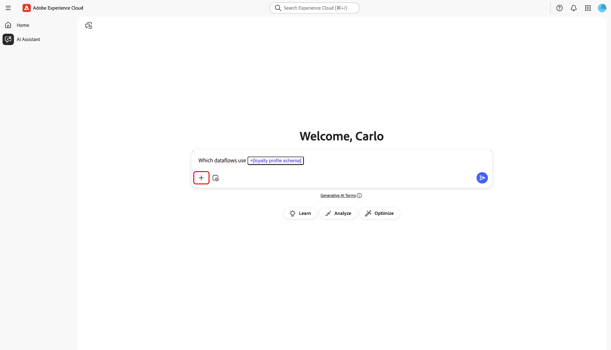

### 驗證回應

您可透過多種方式驗證AI助理的回應。 選取&#x200B;**[!UICONTROL 與物件相符的查詢辭彙]**&#x200B;以檢視查詢中與組織中特定物件相符的辭彙摘要。

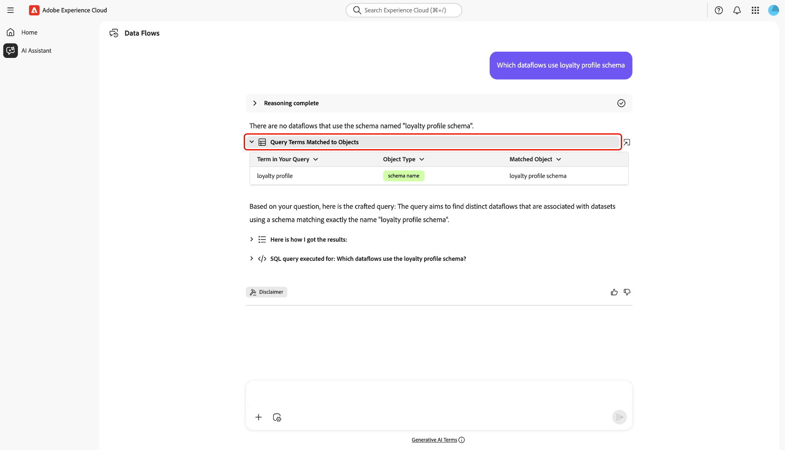

選取&#x200B;**[!UICONTROL 以下是我取得結果的方式]**，以檢視AI助理如何取得答案的詳細逐步說明。 此外，您也可以檢視為回答您問題而執行的SQL查詢。 此查詢是唯讀的，不支援用於查詢服務。

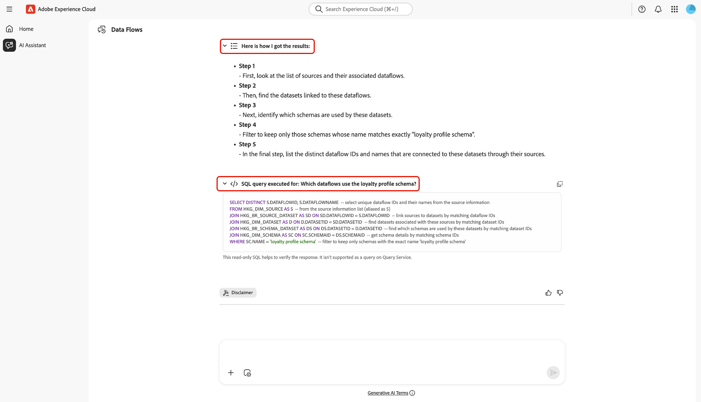

### 設定資料視覺效果

您可以使用AI Assistant的資料視覺化功能來更瞭解您的資料。 您也可以指定要在查詢中使用的圖表型別。 例如，提交顯示： **&quot;依產品名稱顯示上個月利潤（長條圖）&quot;**&#x200B;的查詢，以接收依產品名稱組織的上個月利潤長條圖。

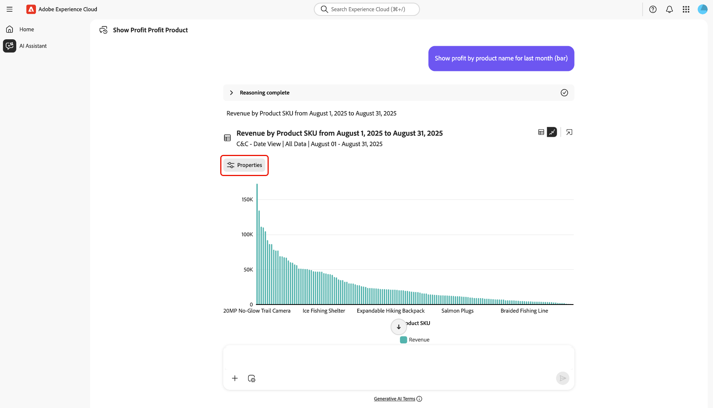

接著，選取&#x200B;**[!UICONTROL 屬性]**&#x200B;以變更圖表型別，並設定X軸與Y軸的值。

AI Assistant支援數種圖表型別用於資料視覺效果。 您可以將滑鼠游標停留在資料上，與所有型別的圖表互動。

>[!BEGINTABS]

>[!TAB Line]

若要檢視線圖，請選取&#x200B;**[!UICONTROL 屬性]**，然後選取&#x200B;**[!UICONTROL 線]**。

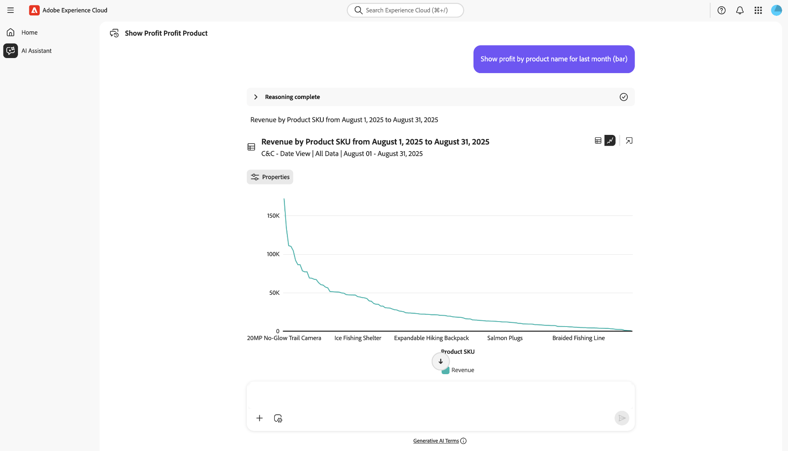

>[!TAB 區域]

若要檢視區域圖，請選取&#x200B;**[!UICONTROL 屬性]**，然後選取&#x200B;**[!UICONTROL 區域]**。

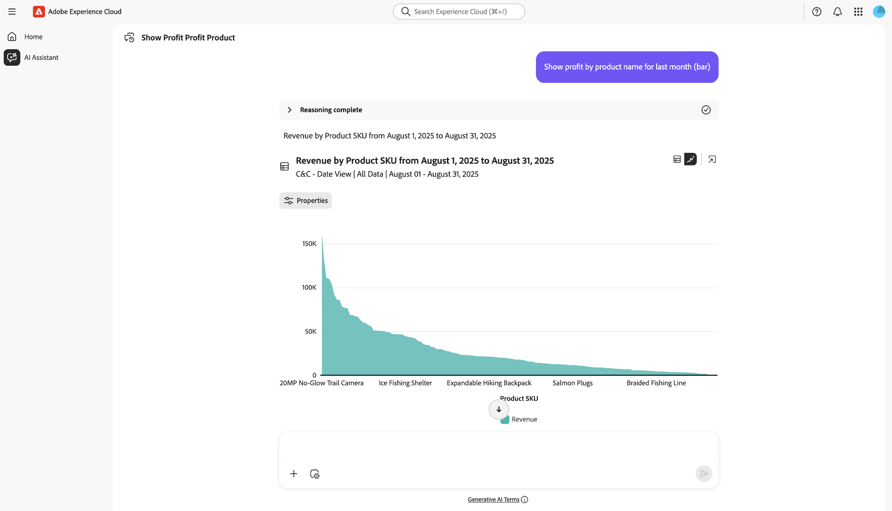

>[!TAB 散佈圖]

若要檢視散佈圖，請選取&#x200B;**[!UICONTROL 屬性]**，然後選取&#x200B;**[!UICONTROL 散佈圖]**。

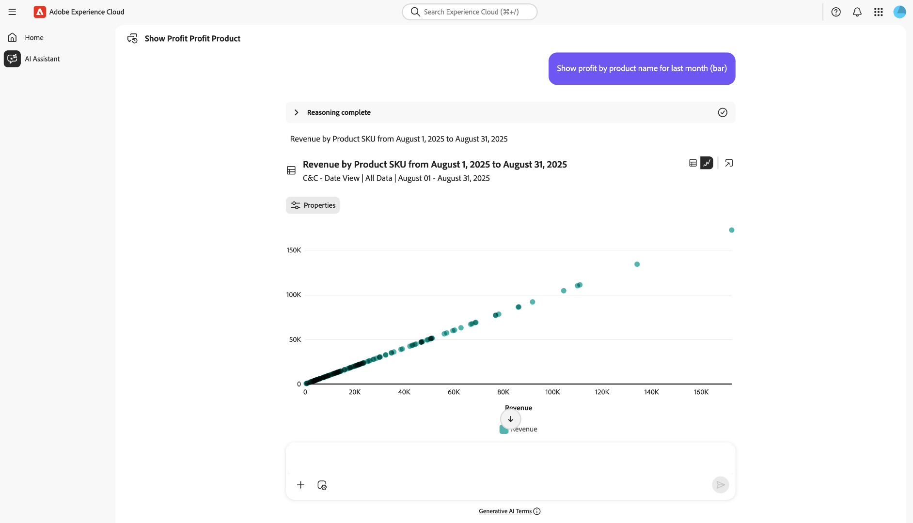

>[!TAB 環形圖]

若要檢視環形圖，請選取&#x200B;**[!UICONTROL 屬性]**，然後選取&#x200B;**[!UICONTROL 環形圖]**。

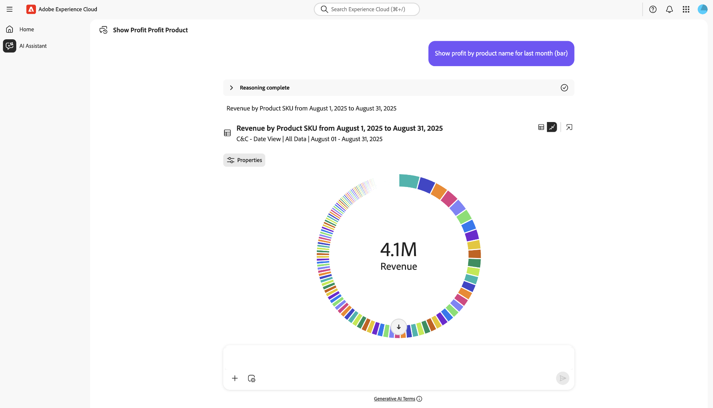

>[!ENDTABS]
